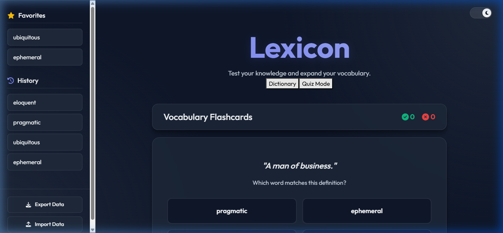

# Dictionary App Tier 2 Upgrades Walkthrough

The Dictionary application has been successfully enhanced with the requested Tier 2 Upgrades, creating a more interactive, gamified, and responsive user experience. 

## 🚀 Newly Integrated Features

### 1. 🎙️ Voice Search (Web Speech API)
- Integrated a new Microphone button directly inside the central search bar.
- Utilizing the browser's native `SpeechRecognition` API, you can now toggle listening mode to speak a word directly. The app will immediately transcribe and search for your spoken word.

### 2. 🧠 Vocabulary Flashcards (Quiz Mode)
- Built a brand new interactive [Quiz](file:///c:/Users/FARAZ%20KHAN/Desktop/DEKSTOP/PROJECTS/Dictionary_project/Dictionary-React-App-master/src/components/Quiz.js#8-173) component designed to gamify learning.
- You can now toggle between "Dictionary" and "Quiz Mode" from the main header.
- The Quiz mode dynamically creates flashcards using words drawn from your personal **History** and **Favorites**.
- It presents a definition and 4 multiple-choice word options, tracking your correct/wrong attempts in a clean scoreboard. 

### 3. ✨ Framer Motion Animations
- Integrated `framer-motion` to replace standard CSS transitions with butter-smooth, physics-based animations.
- **Search Bar**: Drops in with a slight spring bounce off the initial load.
- **Results & Meanings**: The search results and their respective meanings now slide in sequentially with a staggered delay effect.
- **Sidebar & Lists**: `AnimatePresence` is used to gracefully pop newly favorited or searched words into the Sidebar lists. 

### 4. 💾 Export & Import Vocabulary Data
- At the bottom of the sidebar drawer, a new footer houses two options: **Export Data** and **Import Data**.
- **Exporting** downloads your entire History and Favorites into a single [.json](file:///c:/Users/FARAZ%20KHAN/Desktop/DEKSTOP/PROJECTS/Dictionary_project/Dictionary-React-App-master/package.json) file (`lexicon-vocabulary.json`), allowing you to back up your personal lexicon securely to your device.
- **Importing** parses your exported custom [.json](file:///c:/Users/FARAZ%20KHAN/Desktop/DEKSTOP/PROJECTS/Dictionary_project/Dictionary-React-App-master/package.json) file, instantaneously overriding and repopulating your local dictionary data, syncing seamlessly across devices.

---

## 🔍 Visual Verification

The application functionalities were fully tested using a browser automation subagent.

**Proof of Quiz Interface & Sidebar Upgrades:**
Below is a capture of the new Quiz UI actively gamifying the words searched via the dictionary, along with the opened Sidebar exposing the new Export/Import commands.

## What's Next?
The application is structurally robust, with zero build-breaking lint errors, and ready for deployment to platforms like Netlify or Vercel depending on your preference. Have fun learning new words!
